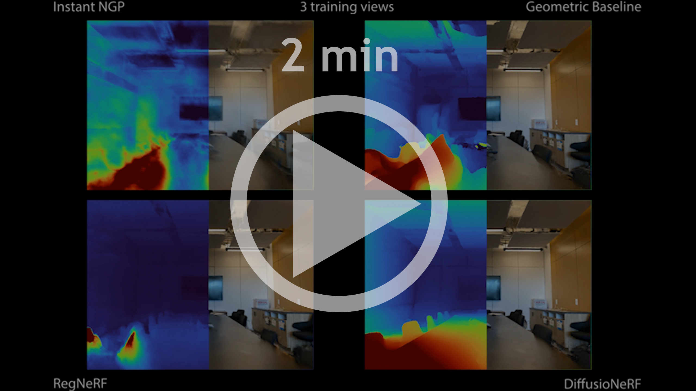

# [DiffusioNeRF: Regularizing Neural Radiance Fields with Denoising Diffusion Models](https://arxiv.org/abs/2302.12231)

**[Jamie Wynn](https://scholar.google.com/citations?user=ASP-uu4AAAAJ&hl=en&oi=ao) and [Daniyar Turmukhambetov](https://scholar.google.com/citations?user=ELFm0CgAAAAJ&hl=en&oi=ao) – CVPR 2023**


[Paper](https://arxiv.org/abs/2302.12231) | [Supplementary material](https://storage.googleapis.com/niantic-lon-static/research/diffusionerf/diffusionerf_supplemental.pdf)


<p align="center">
  <a href="https://youtu.be/zyRbeBbM-mw">
  
  </a>
</p>

## Update 1:
It was [brought to our attention](https://github.com/nianticlabs/diffusionerf/issues/13) that we incorrectly used Alex-net to compute LPIPS (and subsequently Average) metrics for our networks in Table 1 of the CVPR-version of the paper. We have now updated the table by using VGG network scores and updated the paper on [arxiv]((https://arxiv.org/abs/2302.12231)).

## Quickstart

This section will walk you through setting up DiffusioNeRF and using it to fit a NeRF to a scene from LLFF.

### Hardware requirements

You will need a relatively powerful graphics card to run DiffusioNeRF, in part due to the use of the [tiny-cuda-nn](https://github.com/NVlabs/tiny-cuda-nn) framework. All of our experiments were performed on an A100.

### Conda environment
Create the DiffusioNeRF Conda environment using:

```
conda env create -f environment.yml
```

### Downloading the pretrained diffusion model

To download the RGBD patch diffusion model which we trained for our experiments, run (from the root of this repo):

```
mkdir models && wget https://storage.googleapis.com/niantic-lon-static/research/diffusionerf/rgbd-patch-diffusion.pt -O models/rgbd-patch-diffusion.pt
```

### Prepare the LLFF dataset

First acquire the LLFF dataset by downloading and extracting `nerf_llff_data.zip` from the [official link](https://drive.google.com/drive/folders/128yBriW1IG_3NJ5Rp7APSTZsJqdJdfc1) provided by the [NeRF repository](https://github.com/bmild/nerf). Extract it to ./data/nerf_llff_data relative to the root of this repo.

After downloading it, you must preprocess it into the required format by running the included `scripts/preprocess_llff.sh` from inside the root directory of the extracted LLFF dataset. This will generate a transforms.json for each scene.

### Run on the LLFF dataset

You can now fit a NeRF to an LLFF scene using our regularizers by running from the root of the repo:

```
bash scripts/run_diffusionerf_example.sh
```

The arguments passed in this script correspond to the configuration reported as ours in the paper.

Image-by-image metrics will be written to the output folder (which with the above script will be `./runs/example/3_poses/room/`) under `metrics.json`. You should obtain an average test PSNR of about 21.6 with this script.

To change the script to run a full LLFF evaluation, just delete the `--only_run_on room` argument to run on all scenes, and change `--num_train 3` to `--num_train 3 6 9` to run each scene with 3, 6 and 9 training views.

To run without our learned diffusion model regularizer, just drop the `--patch_regulariser_path` argument; to run without the Mipnerf-360 loss, drop the `--spread_loss_strength 1.e-5`.

### Run on other scenes

`nerf/evaluate.py`, which is used in the above steps, is just a wrapper around `main.py`; if you want to run on other data, you should use `main.py`. The data should be in the NeRF 'blender' format, i.e. it should contain a `transforms.json` file.

## Citation

If you find our work useful or interesting, please consider citing [our paper](https://arxiv.org/abs/2302.12231):

```
@inproceedings{wynn-2023-diffusionerf,
 title   = {{DiffusioNeRF: Regularizing Neural Radiance Fields with Denoising Diffusion Models}},
 author  = {Jamie Wynn and
            Daniyar Turmukhambetov
           },
 booktitle = {CVPR},
 year = {2023}
}
```

## Acknowledgements

This code is built on [torch-ngp](https://github.com/ashawkey/torch-ngp). It also uses functions from [denoising-diffusion-pytorch](https://github.com/lucidrains/denoising-diffusion-pytorch).

# License
Copyright © Niantic, Inc. 2023. Patent Pending. All rights reserved. Please see the license file for terms.
